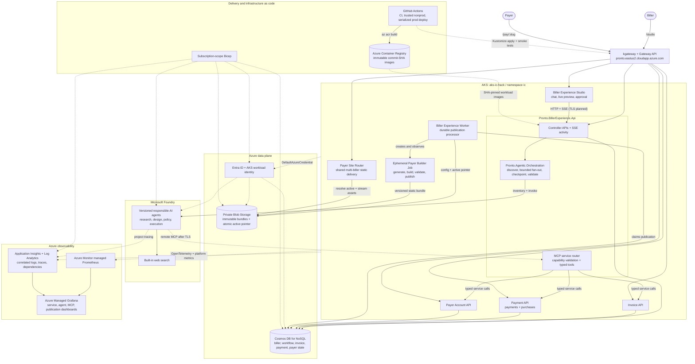

# Pronto Biller Studio

Pronto Biller Studio is an agent-assisted onboarding and experience-publishing platform for billers.
A biller describes its brand and payment experience through chat, previews and approves the result,
and receives an installable, fully branded PWA rendered by a shared Kubernetes deployment. Customers
remain inside the biller's branded experience and existing Pronto payment rails remain
unchanged.

The disruption is onboarding speed and customization, not money movement.

## Status

Phases 2 through 4 now provide a runnable local vertical slice: versioned controller contracts,
agent-assisted onboarding with a deterministic fallback, Cosmos and in-memory repositories,
approval and idempotent publication requests, the Biller Studio, and a configuration-driven payer
PWA. Phase 5 publishes immutable per-biller artifacts to Azure Blob Storage and activates them in
the shared payer renderer. The supporting payment experience is still backed by local demo
providers until the existing Pronto payment APIs are connected.

The documents under [`design/`](design/README.md) came from the original `main` branch and remain
the source of truth for supporting service responsibilities, entities, REST behavior, and agent
boundaries. This README and `Pronto.slnx` are the source of truth for repository and solution structure.
Where the documents use conceptual names such as "Biller Configuration Service," the mapping below
defines the concrete .NET project that implements that capability.

## Product and component names

| Concern | Name | Runtime name |
| --- | --- | --- |
| Product | Pronto Biller Studio | — |
| Agentic experience API | `Pronto.BillerExperience.Api` | `ic-biller-experience-api` |
| Publishing worker | `Pronto.BillerExperience.Worker` | `ic-biller-experience-worker` |
| Orchestration library | `Pronto.Agentic.Orchestration` | — |
| Public contracts | `Pronto.BillerExperience.Contracts` | — |
| Customer application | `Pronto.BillerPayments.Pwa` | `ic-biller-payments-pwa` |
| Operational database | `ic-biller-experience` | — |

The service is named after the business capability rather than the implementation. Agentic
orchestration can evolve without renaming the API used by billers and other Pronto systems.

## Architecture



Solid arrows are active request, orchestration, publication, and data paths. The dashed Foundry-to-MCP
path is intentionally gated in the current production environment: the public Gateway is HTTP-only,
so remote MCP is disabled until TLS is configured. The MCP service router and its deterministic tools
are deployed, tested, and ready for that connection; agents never access service storage directly.

The shared tier creates no per-biller Deployment. Publication runs a short-lived, locked-down builder
Job, writes an immutable bundle plus an atomic active pointer to private Blob Storage, and the shared
Router serves `/pay/:slug`. The reviewed PWA source remains the builder input. Dedicated pods and
routes are reserved for a future isolated paid tier.

Production service APIs validate Entra bearer tokens and biller claims. MCP tools add short-lived,
biller-scoped capabilities; payer tools require a server-bound payer verification token. Only the
Execution Agent can submit an idempotent payment intent, and only after explicit payer confirmation.
Agents configure and recommend; deterministic services own state transitions and money movement.

The generated artifact is a typed, versioned `BillerExperienceDefinition`. Agents may generate
content and configuration, but they may not generate executable application code, container build
instructions, shell commands, or raw Kubernetes manifests. Publication writes validated JSON and
manifest artifacts; every biller uses the same reviewed PWA image.

### Agents, orchestration, and shared context

Agents and orchestration are deliberately separate. Research, design, accessibility, and
compliance agents perform bounded domain work and return typed results. The
`Pronto.Agentic.Orchestration` library discovers and delegates to agents, sequences dependencies,
fans independent reviews out in parallel, passes results, enforces timeouts, records state and
activity, and decides whether the goal can continue or must fail.

Every agent instruction imports [`agents/RESPONSIBLE_AI.md`](agents/RESPONSIBLE_AI.md). Runtime
guardrails repeat the policy at provider boundaries and validate cited output. Shared learning is
biller- and run-scoped in Cosmos DB. Remote agents access it through the stateless `/mcp` endpoint
using `get_goal_context` and `append_context`; orchestration issues a short-lived HMAC capability
bound to the biller, run, agent, and read/write permission. The public MCP API key is a demo-level
connection credential, not the tenant boundary. Context rejects likely secrets, payment instrument
data, oversized entries, uncited external claims, and stale writes. Private chain-of-thought is
never stored.

HTTP MCP endpoints are supported for local and hackathon environments. Production should expose
the endpoint over HTTPS and source both MCP secrets from Key Vault. Foundry may require HTTPS for
its remote MCP connection even when the IC API permits HTTP.

### Capability ownership

| Documented capability | Concrete project/location | Ownership |
| --- | --- | --- |
| Biller Configuration Service | `services/Pronto.BillerExperience.Api` | Biller Experience |
| Deployment Service | `services/Pronto.BillerExperience.Worker` | Biller Experience |
| Biller Onboarding Experience | `frontends/Pronto.BillerExperience.Studio` | Biller Experience |
| Payer Experience | `frontends/Pronto.BillerPayments.Pwa` | Biller Experience |
| Invoice Service | `services/Pronto.Invoice.Api` | Supporting service; follow `design/` |
| Payment Service | `services/Pronto.Payment.Api` | Supporting service; follow `design/` |
| Payer Account Service | `services/Pronto.PayerAccount.Api` | Supporting service; follow `design/` |
| Notification Service | future `services/Pronto.Notification.Worker` | Stretch; follow `design/` |
| AI Foundry agent definitions | `agents/` | Follow `design/services.md` |

Supporting services retain the behavior documented on `main`, including integer-cent money values,
Cosmos tenant partitioning, deterministic ownership of persistence and payment actions, and explicit
human confirmation before the Execution Agent can initiate a payment. The Biller Experience only
configures and invokes those capabilities; it does not absorb their data or money-movement logic.

## Repository layout

```text
ic/
├── Pronto.slnx
├── Directory.Build.props
├── Directory.Packages.props
├── global.json
├── contracts/
│   ├── Pronto.Contracts.slnx
│   └── Pronto.BillerExperience.Contracts/
├── libraries/
│   └── Pronto.Agentic.Orchestration/
├── services/
│   ├── Pronto.BillerExperience.Api/
│   └── Pronto.BillerExperience.Worker/
├── frontends/
│   ├── Pronto.BillerExperience.Studio/
│   └── Pronto.BillerPayments.Pwa/
├── deploy/
│   ├── helm/
│   └── kubernetes/
├── infra/
│   └── bicep/
└── tests/
```

`contracts` contains transport contracts only. Persistence entities, Kubernetes SDK types, and
Microsoft Agent Framework types must never become part of those public contracts.

`libraries/Pronto.Agentic.Orchestration` owns Pronto's framework-neutral orchestration API. Microsoft Agent
Framework can be used internally, but consumers depend on Pronto abstractions.

`services` contains independently deployable .NET 10 workloads. Frontends and infrastructure are
kept separate from service implementation.

`design` preserves the existing system design and capability boundaries. `agents` contains the
AI Foundry agent definitions described there. New supporting services use the `Pronto.<Capability>.*`
project naming and are added to `Pronto.slnx`; they are not introduced as a competing repository layout.

## Onboarding workflow

The production workflow is typed, checkpointed, resumable, and observable:

1. Create the biller and onboarding session.
2. Collect required brand, support, legal, PWA, and payment-capability information.
3. Discover approved Foundry research agents and fan out bounded, cited web research.
4. Consolidate successful evidence, preserving partial failures as a degraded result.
5. Produce a structured experience draft from biller input plus untrusted research evidence.
6. Validate policy and accessibility concurrently, then merge findings deterministically.
7. Render a live preview.
8. Wait for explicit biller approval.
9. Persist an immutable experience revision.
10. Request publication idempotently using biller ID and revision.
11. Write immutable versioned artifacts to private Blob Storage.
12. Verify the artifact, atomically replace the active pointer, and mark the revision published.

An API or worker restart must not lose a workflow. Every step records its checkpoint and can be
retried without duplicating the deployment.

## Contracts

Contracts are versioned under `Pronto.BillerExperience.Contracts/V1` and grouped by capability:

- `Billers`: identity, brand, support, and existing payment-rail references.
- `Onboarding`: sessions and biller messages.
- `Experiences`: editable definitions, immutable revisions, approval, and publication.
- `Deployments`: publication status and failure information.
- `Events`: business events emitted by the onboarding and publication processes.
- `Research`: cited facts, sources, warnings, and completed/degraded/failed outcomes.

`BillerExperienceDefinition` is the contract between agent-assisted onboarding, preview, storage,
and the customer PWA. It contains a schema version, brand tokens, content, PWA configuration,
support/legal links, and references to enabled existing payment capabilities. It never contains
payment credentials.

Supporting-service wire behavior remains defined in [`design/contracts.md`](design/contracts.md).
As those services are implemented, each receives its own versioned project under `contracts/` and
is included in `contracts/Pronto.Contracts.slnx`; supporting-service DTOs do not get folded into
`Pronto.BillerExperience.Contracts`.

## Orchestration library

`Pronto.Agentic.Orchestration` replaces the prototype's in-memory orchestration mode switchboard with
small, typed seams:

- `IOrchestrationWorkflow<TInput,TOutput>` defines a workflow.
- `IOrchestrationStep<TInput,TOutput>` defines one typed unit of work.
- `IOrchestrationRunner` executes workflows and owns cross-cutting telemetry.
- `IOrchestrationStateStore` will persist checkpoints and resumable state.
- agent, tool-policy, structured-output, and human-approval adapters are added behind these seams.

The biller workflow is deterministic. Models help interpret and synthesize; normal code validates,
authorizes, persists, deploys, and verifies.

The Research Coordinator uses these same orchestration seams. It discovers persisted Foundry
agents at request time, requires approval/capability metadata, applies an optional ID allowlist,
fans out with bounded concurrency and per-agent timeouts, and consolidates cited results through a
configured coordinator agent. Without a configured coordinator, successful worker results are
merged deterministically. Individual agent failures are logged and surfaced as a degraded workflow
event rather than making the Studio silently lose the page.

## Persistence

Azure Cosmos DB for NoSQL is the store defined by the original design. Biller Experience follows
the existing entity-container model and adds a separate container only for orchestration state:

| Container | Partition key | Contents |
| --- | --- | --- |
| `billers` | `/id` | tenant-root `BillerAccount` documents |
| `configs` | `/biller_id` | versioned biller experience configuration |
| `deployments` | `/biller_id` | published deployment records (target: includes the blob container/prefix a revision was published to, for shared-tier billers) |
| `orchestration_runs` | `/biller_id` | sessions, checkpoints, sanitized interactions, append-only agent activity, publish jobs |

Invoice, payment, purchase, payer-account, and notification containers remain owned by their
supporting services exactly as described in [`design/entities.md`](design/entities.md).

Safety requirements:

- Microsoft Entra Workload Identity and Cosmos RBAC; no database keys in pods.
- Private endpoint with public network access disabled.
- Continuous backup and point-in-time restore.
- `_etag` optimistic concurrency and transactional batches within a biller partition.
- Immutable approved/published revisions.
- TTL and redaction for interaction history.
- Application-level contract and policy validation despite the flexible document schema.

## Frontends

Two deliberately small frontends are planned:

### Pronto Biller Studio

- conversational onboarding
- missing-information checklist
- desktop/mobile live preview
- revision history
- explicit approve and publish action
- streaming workflow and deployment status

### Pronto Biller Payments PWA

- one reviewed, immutable application image
- CSS custom properties and configuration-driven composition
- web manifest and service worker
- accessible, responsive payment components
- integration only with existing Pronto payment APIs
- no Pronto customer-facing branding

Every biller uses the same vetted, horizontally replicated renderer. The URL slug selects a
private, API-delivered active artifact, while immutable revisions remain available for audit and
rollback. Generated content is data only and cannot introduce executable JavaScript.

Isolated-tier billers remain a future exception and may receive dedicated compute when regulatory,
scaling, or executable-customization requirements justify it.

## Publication model

The publishing worker has a dedicated Azure workload identity with Cosmos data-plane and Blob
write access, but no AI Foundry or Kubernetes mutation permissions. The API identity can read the
private artifact container. Publication is idempotent on `billerId + revision`: immutable revision
objects are uploaded first, verified, and followed by one atomic `active.json` overwrite.

The shared PWA deployment runs at least two replicas behind `/pay/{slug}/`. Dedicated deployments
remain a future exception for custom executable code, unusual scaling, or regulatory isolation.

## Azure observability

All workloads use OpenTelemetry and are observable through Azure:

- Application Insights: correlated API, workflow, agent, model, tool, storage, and publication
  traces.
- Log Analytics and Container Insights: structured application and container logs.
- Azure Monitor managed Prometheus: Kubernetes and application metrics.
- Azure Managed Grafana: platform and product dashboards.
- AKS diagnostic settings: control-plane and audit logs.
- Azure Monitor alerts and action groups: SLO and failure notification.

Every onboarding operation carries `traceId`, `billerId`, `onboardingSessionId`,
`experienceRevision`, `workflowRunId`, and `deploymentName`. Prompts, payment data, customer data,
and raw model responses are not attached to normal telemetry.

Initial product and operational metrics include onboarding completion time, validation failures,
model/tool latency and errors, token usage, publication duration and failures, rollback count, pod
readiness/restarts, Cosmos throttling, PWA availability, and payment-page request latency.

## Security boundaries

- Microsoft Entra Workload Identity for Cosmos DB, Key Vault, ACR, and Azure model access.
- Private endpoints for data and platform dependencies.
- Azure Front Door/WAF or Application Gateway in front of public traffic.
- Separate API and publishing-worker identities.
- Explicit tool allowlists for every agent.
- No shell, raw Kubernetes, arbitrary SQL, or source-generation tool exposed to an agent.
- Schema, policy, accessibility, and payment-capability validation before preview or publish.
- Explicit biller approval and immutable audit history before publication.
- Existing services remain responsible for payment authorization, processing, and settlement.

## Delivery plan

### Phase 1 — Foundation

- [x] Establish repository and .NET 10 build configuration.
- [x] Add contracts, orchestration, API, worker, frontend, deployment, infrastructure, and test
  boundaries.
- [x] Add initial versioned contracts and typed orchestration abstractions.
- [x] Add API and worker host skeletons.
- [x] Rebase onto the existing design and map its capabilities into the Pronto solution structure.
- [ ] Add CI, ownership, and architecture decision records.

### Phase 2 — Orchestration and persistence

- [x] Implement the biller onboarding workflow and structured model output.
- [x] Add Cosmos DB repositories, checkpoints, optimistic concurrency, and redaction boundaries.
- [x] Add cancellation, publication idempotency, policy gates, and explicit approval.
- [x] Add orchestration traces, metrics, and structured error logging.

### Phase 3 — API and Biller Studio

- [x] Implement controller-based biller/session/message/preview/approval/publication endpoints.
- [x] Stream workflow status with server-sent events.
- [x] Build the minimal chat, checklist, live preview, review, approval, and publication UI.

### Phase 4 — Customer PWA

- [x] Build the configuration-driven payment shell.
- [x] Add manifest, service worker, accessibility, responsive brand tokens, and independent
  AutoPay/paperless consent.
- [x] Add a typed payment provider boundary with a local demo provider until the documented
  supporting payment and invoice services are available.

### Phase 5 — Payer site publication (pivoted to shared router + Blob Storage)

- [x] Add a Storage Account to `infra/bicep` (`payer-experiences` blob container, Blob Reader for
  `ic-workload`, and Blob Contributor for the separate `biller-publisher` identity).
- [ ] Implement Worker publish logic: build a biller's static PWA bundle from its approved
  configuration, upload to a `biller_id`-keyed blob container/prefix, retain the previous revision
  for rollback, and persist publish status.
- [ ] Build the shared Payer Site Router workload: resolve biller from the request, serve the
  matching blob prefix, single `HTTPRoute` for all shared-tier billers.
- [ ] Add rollout smoke test against the router and reconciliation.
- [ ] Isolated tier (paid upgrade): keep the original per-biller Deployment/Service/HTTPRoute path
  (namespace RBAC, network policy, pod security) for billers who pay for dedicated compute.

### Phase 6 — Azure platform and hardening

- [x] Provision AKS, ACR, Cosmos DB, Storage Account, Application Insights, managed Prometheus, and
  Managed Grafana with Bicep. Key Vault not yet started.
- [ ] Add dashboards, alerts, runbooks, audit retention, load tests, and failure exercises.

## Definition of the first vertical slice

A biller can create an onboarding session, chat until the required fields are complete, preview and
approve a generated experience, and publish it. Publication produces a new ready AKS Deployment and
a reachable branded PWA URL. Cosmos DB records the biller, approved revision, workflow checkpoints,
and deployment outcome. Application Insights contains one correlated trace from the publish request
through Kubernetes readiness. Payment movement is unchanged.

## Build

Prerequisite: .NET SDK 10.0.301 or a compatible 10.0 feature-band patch.

```powershell
dotnet restore .\Pronto.slnx
dotnet build .\Pronto.slnx --no-restore
dotnet test .\Pronto.slnx --no-build
```

Run the service hosts locally:

```powershell
dotnet run --project .\services\Pronto.BillerExperience.Api
dotnet run --project .\services\Pronto.BillerExperience.Worker
```

The API defaults to in-memory persistence and the deterministic model provider, so no Azure
credentials are required for a local run. Set `BillerExperience__Persistence__Provider=Cosmos` and
`BillerExperience__Persistence__CosmosEndpoint`, or set
`BillerExperience__Model__Provider=AzureAI` and `BillerExperience__Model__Endpoint`, to use the
Azure implementations with `DefaultAzureCredential`.

Run either frontend with `npm install` followed by `npm run dev` in its folder. Biller Studio uses
`http://localhost:5000` by default; override it with `VITE_API_URL`.

The API exposes `/`, `/health/live`, `/health/ready`, and controller routes rooted at `/billers`.
Logs are emitted as newline-delimited JSON for AKS/Container Insights ingestion. Application
Insights is enabled when `APPLICATIONINSIGHTS_CONNECTION_STRING` is present; traces and metrics
include the custom Biller Experience and orchestration sources without recording prompts or raw
model output.
